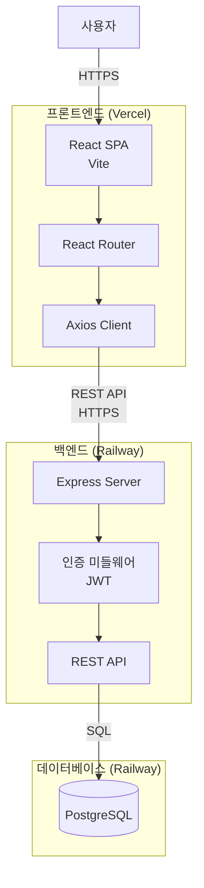
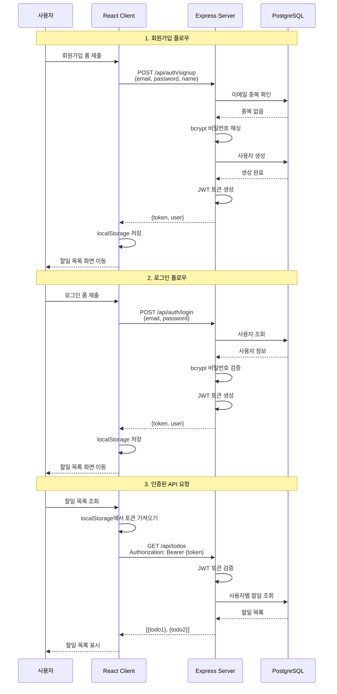
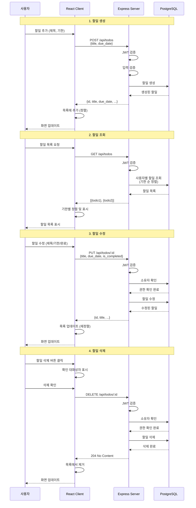
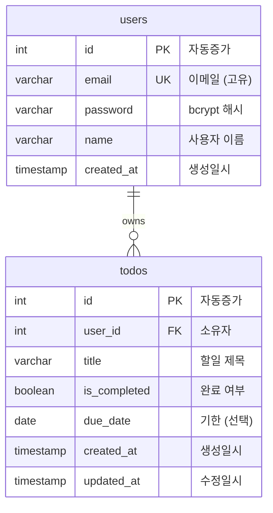
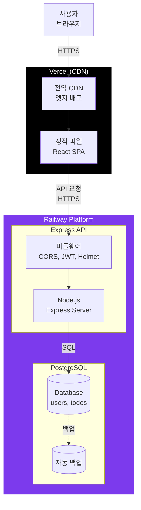
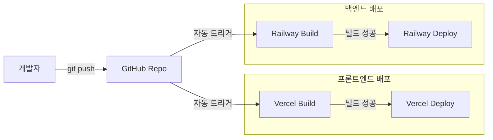
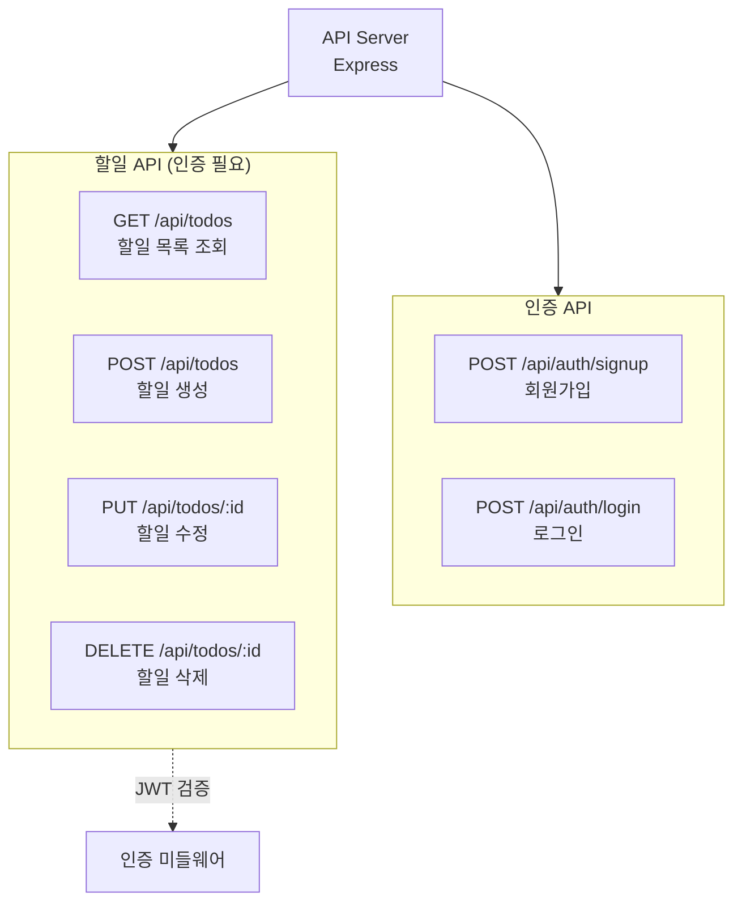
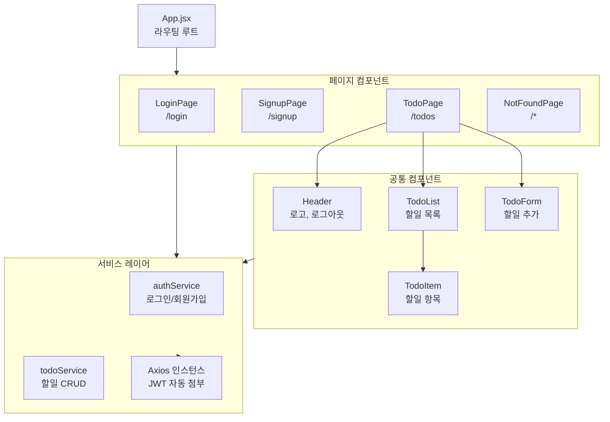
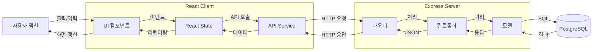
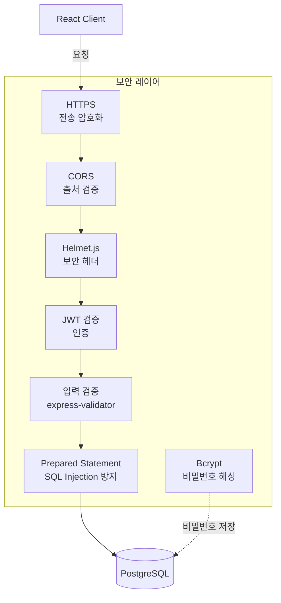

# Jan TodoList - 기술 아키텍처 다이어그램

## 문서 정보
- **버전**: 1.0
- **작성일**: 2025-11-26
- **최종 수정일**: 2025-11-26
- **작성자**: Development Team
- **문서 상태**: 최종
- **참조 문서**: [PRD](./2-prd.md), [도메인 정의서](./1-domain-definition.md)

---

## 1. 시스템 아키텍처

### 개요
Jan TodoList는 3계층 아키텍처를 기반으로 하는 웹 애플리케이션입니다. 프론트엔드(React SPA), 백엔드(Express API), 데이터베이스(PostgreSQL)로 구성됩니다.

### 핵심 컴포넌트
- **프론트엔드**: React 18 + Vite, Tailwind CSS
- **백엔드**: Node.js + Express, JWT 인증
- **데이터베이스**: PostgreSQL, 관계형 데이터 모델
- **배포**: Vercel (프론트엔드), Railway (백엔드 + DB)

---

## 2. 인증 플로우

### 개요
JWT 기반 토큰 인증 방식을 사용합니다. 회원가입/로그인 시 토큰을 발급받아 localStorage에 저장하고, 이후 모든 API 요청에 자동으로 포함시킵니다.

### 보안 사항
- 비밀번호는 bcrypt로 해싱 (10 rounds)
- JWT 토큰 만료 시간: 24시간
- HTTPS 필수 (토큰 탈취 방지)
- 토큰은 localStorage에 저장

---

## 3. 할일 CRUD 플로우

### 개요
할일 생성, 조회, 수정, 삭제의 전체 흐름을 보여줍니다. 모든 작업은 인증이 필요하며, 사용자는 자신의 할일만 관리할 수 있습니다.

### 권한 관리
- 모든 CRUD 작업은 JWT 인증 필요
- 사용자는 자신의 할일만 조회/수정/삭제 가능
- 소유자 검증은 서버에서 수행 (보안)

---

## 4. 데이터베이스 ERD

### 개요
간단한 2개 테이블 구조로, users와 todos가 1:N 관계를 갖습니다.

### 테이블 설명

#### users 테이블
- `id`: 기본키, 자동 증가
- `email`: 유니크 제약조건, 로그인 ID
- `password`: bcrypt 해시 (최소 10 rounds)
- `name`: 사용자 표시 이름
- `created_at`: 가입일시

#### todos 테이블
- `id`: 기본키, 자동 증가
- `user_id`: 외래키 (users.id), ON DELETE CASCADE
- `title`: 할일 제목 (1-200자)
- `is_completed`: 완료 여부 (기본값: false)
- `due_date`: 기한 (DATE 타입, NULL 허용)
- `created_at`: 생성일시
- `updated_at`: 최종 수정일시

### 인덱스
- `idx_todos_user_id`: 사용자별 조회 성능 향상
- `idx_todos_due_date`: 기한 기반 정렬 성능 향상

---

## 5. 배포 아키텍처

### 개요
프론트엔드는 Vercel, 백엔드와 데이터베이스는 Railway에 배포됩니다. 모든 통신은 HTTPS로 암호화됩니다.

### 배포 환경

#### Vercel (프론트엔드)
- **역할**: React SPA 정적 파일 호스팅
- **특징**:
  - 전역 CDN을 통한 빠른 응답
  - 자동 HTTPS 인증서
  - Git 기반 자동 배포
  - 환경 변수: `VITE_API_URL`

#### Railway (백엔드 + DB)
- **역할**: Express API 서버 + PostgreSQL 데이터베이스
- **특징**:
  - 컨테이너 기반 배포
  - 자동 스케일링
  - PostgreSQL 자동 백업
  - 환경 변수: `DATABASE_URL`, `JWT_SECRET`, `CORS_ORIGIN`

### 배포 흐름

### 환경 변수 관리

#### 프론트엔드 (Vercel)
- `VITE_API_URL`: 백엔드 API URL (예: https://api.jan-todolist.railway.app)

#### 백엔드 (Railway)
- `DATABASE_URL`: PostgreSQL 연결 문자열 (자동 생성)
- `JWT_SECRET`: JWT 서명 키 (수동 설정)
- `CORS_ORIGIN`: 허용할 프론트엔드 도메인 (예: https://jan-todolist.vercel.app)
- `NODE_ENV`: production

---

## 6. API 엔드포인트 구조

### 개요
RESTful API 설계 원칙을 따르며, 인증과 할일 관리로 구분됩니다.

### API 엔드포인트 목록

#### 인증 API (인증 불필요)
- `POST /api/auth/signup`: 회원가입
- `POST /api/auth/login`: 로그인

#### 할일 API (인증 필요)
- `GET /api/todos`: 사용자별 할일 목록 조회 (기한 순 정렬)
- `POST /api/todos`: 새 할일 생성
- `PUT /api/todos/:id`: 할일 수정 (제목/기한/완료 상태)
- `DELETE /api/todos/:id`: 할일 삭제

---

## 7. 프론트엔드 구조

### 개요
React 컴포넌트 기반 SPA로, 페이지와 재사용 컴포넌트로 구성됩니다.

### 라우팅 구조
- `/login`: 로그인 화면
- `/signup`: 회원가입 화면
- `/todos`: 할일 목록 화면 (보호된 라우트)
- `/*`: 404 페이지

---

## 8. 데이터 흐름 다이어그램

### 개요
사용자 액션부터 데이터베이스 업데이트까지의 전체 데이터 흐름을 보여줍니다.

---

## 9. 보안 아키텍처

### 개요
애플리케이션의 주요 보안 메커니즘을 보여줍니다.

### 보안 조치 목록

#### 전송 보안
- **HTTPS**: 모든 통신 암호화 (Vercel, Railway 자동 제공)
- **CORS**: 허용된 도메인만 API 접근 가능

#### 인증/인가
- **JWT**: 토큰 기반 인증 (만료 시간: 24시간)
- **bcrypt**: 비밀번호 해싱 (10 rounds)
- **권한 검증**: 서버에서 소유자 확인

#### 입력 검증
- **클라이언트**: React Hook Form 검증
- **서버**: express-validator 검증
- **SQL Injection 방지**: Prepared Statement 사용

#### 보안 헤더
- **Helmet.js**: XSS, Clickjacking 등 방지

---

## 부록

### A. 기술 스택 버전
- React: 18.2.0
- Node.js: 18.x
- Express: 4.18.2
- PostgreSQL: 14.x
- Vite: 5.x
- Tailwind CSS: 3.3.0

### B. 성능 목표
- API 응답 시간: 500ms 이내 (p95)
- 페이지 로드 시간: 2초 이내
- Lighthouse 점수: 80점 이상

### C. 확장 계획 (Phase 2)
- 알림 시스템 (WebSocket 또는 Server-Sent Events)
- 캘린더 뷰 (FullCalendar 라이브러리)
- 할일 공유 (새로운 API 엔드포인트)
- 외부 캘린더 연동 (Google Calendar API)

---

**문서 작성 완료일**: 2025-11-26
**다음 단계**: 이 아키텍처를 기반으로 개발 시작
