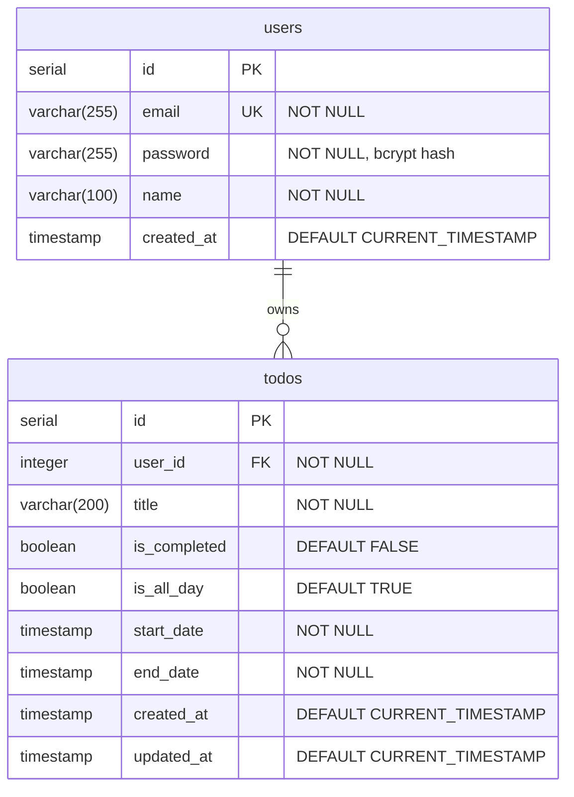
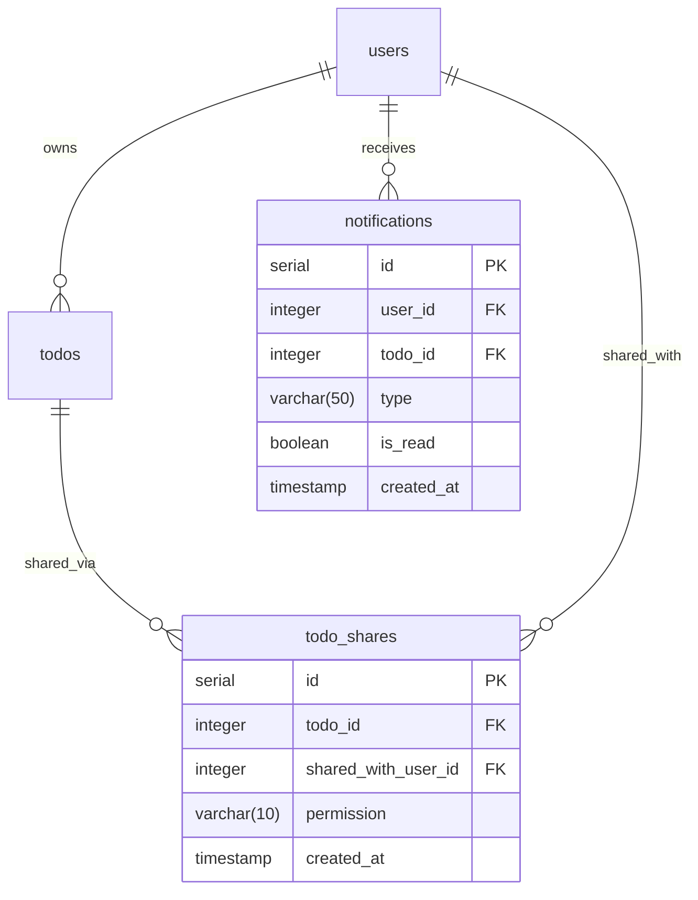

# Jan TodoList - ERD (Entity Relationship Diagram)

## 문서 정보
- **버전**: 1.1
- **작성일**: 2025-11-26
- **최종 수정일**: 2025-11-28
- **작성자**: Development Team
- **문서 상태**: Phase 1 (3일 스프린트)
- **참조 문서**: [PRD](./2-prd.md), [도메인 정의서](./1-domain-definition.md)

### 변경 이력
| 버전 | 날짜 | 변경 내용 | 작성자 |
|-----|------|----------|--------|
| 1.0 | 2025-11-26 | 최초 작성 - Phase 1 ERD | Development Team |
| 1.1 | 2025-11-28 | DB 스키마 동기화 - due_date → start_date/end_date/is_all_day 모델로 변경 | Development Team |

---

## 목차
1. [ER 다이어그램](#1-er-다이어그램)
2. [테이블 상세 명세](#2-테이블-상세-명세)
3. [관계 정의](#3-관계-정의)
4. [제약조건](#4-제약조건)
5. [인덱스](#5-인덱스)
6. [DDL (데이터 정의어)](#6-ddl-데이터-정의어)
7. [샘플 데이터](#7-샘플-데이터)

---

## 1. ER 다이어그램

### 1.1 전체 ERD (Mermaid)



### 1.2 관계 설명
- **users → todos**: 1:N (한 사용자는 여러 할일을 소유)
- **관계 타입**: 소유 관계 (Ownership)
- **삭제 규칙**: CASCADE (사용자 삭제 시 해당 사용자의 모든 할일도 삭제)

---

## 2. 테이블 상세 명세

### 2.1 users (사용자)

**테이블 설명**: 애플리케이션 사용자 정보를 저장하는 테이블

| 컬럼명 | 데이터 타입 | 제약조건 | 기본값 | 설명 |
|--------|------------|---------|--------|------|
| `id` | SERIAL | PRIMARY KEY | AUTO INCREMENT | 사용자 고유 식별자 |
| `email` | VARCHAR(255) | UNIQUE, NOT NULL | - | 사용자 이메일 (로그인 ID) |
| `password` | VARCHAR(255) | NOT NULL | - | bcrypt 해시된 비밀번호 |
| `name` | VARCHAR(100) | NOT NULL | - | 사용자 이름 |
| `created_at` | TIMESTAMP | NOT NULL | CURRENT_TIMESTAMP | 계정 생성일시 |

**비즈니스 규칙**:
- 이메일은 유일해야 함 (중복 불가)
- 비밀번호는 bcrypt로 해싱하여 저장 (최소 10 rounds)
- 최소 8자 이상의 비밀번호 검증은 애플리케이션 레벨에서 처리
- 이메일 형식 검증은 애플리케이션 레벨에서 처리

**예시 데이터**:
```sql
id: 1
email: test@example.com
password: $2b$10$abcdefghijklmnopqrstuvwxyz... (bcrypt hash)
name: 홍길동
created_at: 2025-11-26 10:00:00
```

---

### 2.2 todos (할일)

**테이블 설명**: 사용자의 할일 목록을 저장하는 테이블

| 컬럼명 | 데이터 타입 | 제약조건 | 기본값 | 설명 |
|--------|------------|---------|--------|------|
| `id` | SERIAL | PRIMARY KEY | AUTO INCREMENT | 할일 고유 식별자 |
| `user_id` | INTEGER | FOREIGN KEY, NOT NULL | - | 소유자 (users.id) |
| `title` | VARCHAR(200) | NOT NULL | - | 할일 제목 (1-200자) |
| `is_completed` | BOOLEAN | NOT NULL | FALSE | 완료 여부 |
| `is_all_day` | BOOLEAN | NOT NULL | TRUE | 하루종일 여부 (true: 날짜만, false: 날짜+시간) |
| `start_date` | TIMESTAMP | NOT NULL | - | 시작 날짜/시간 |
| `end_date` | TIMESTAMP | NOT NULL | - | 종료 날짜/시간 |
| `created_at` | TIMESTAMP | NOT NULL | CURRENT_TIMESTAMP | 생성일시 |
| `updated_at` | TIMESTAMP | NOT NULL | CURRENT_TIMESTAMP | 최종 수정일시 |

**비즈니스 규칙**:
- 제목은 1-200자 사이여야 함 (애플리케이션 레벨 검증)
- `start_date`와 `end_date`는 필수 (NOT NULL)
- `is_all_day`가 true인 경우: 시간 부분은 00:00:00으로 통일
- `is_all_day`가 false인 경우: 정확한 시간 지정 가능
- `end_date`는 `start_date`보다 같거나 커야 함 (애플리케이션 레벨 검증)
- 과거 날짜는 허용하지 않음 (애플리케이션 레벨 검증)
- `is_completed` 기본값은 FALSE (미완료)
- `updated_at`은 수정 시 자동 업데이트 (트리거)

**정렬 기준** (애플리케이션 레벨):
```sql
ORDER BY
  start_date ASC,      -- 시작일 가까운 순
  created_at DESC      -- 동일 시작일 시 최신 순
```

**예시 데이터**:
```sql
id: 1
user_id: 1
title: 프로젝트 보고서 작성
is_completed: false
is_all_day: true
start_date: 2025-11-27 00:00:00
end_date: 2025-11-27 00:00:00
created_at: 2025-11-26 10:30:00
updated_at: 2025-11-26 10:30:00
```

---

## 3. 관계 정의

### 3.1 users → todos (1:N)

**관계 타입**: One-to-Many (일대다)

**외래 키**: `todos.user_id` → `users.id`

**삭제 규칙**: ON DELETE CASCADE
- 사용자가 삭제되면 해당 사용자의 모든 할일도 함께 삭제됨
- 데이터 무결성 유지

**업데이트 규칙**: 기본 (RESTRICT)
- `users.id` 변경 시도는 외래 키 제약으로 인해 차단됨
- 실무에서는 PK를 변경하지 않는 것이 원칙

**관계 카디널리티**:
```
users (1) ──────< (N) todos
```

**예시 시나리오**:
1. 사용자 "홍길동" (id=1) 생성
2. 할일 "프로젝트 제출" (user_id=1) 생성
3. 할일 "병원 예약" (user_id=1) 생성
4. 사용자 "홍길동" 삭제 → 2개 할일 자동 삭제

---

## 4. 제약조건

### 4.1 PRIMARY KEY (기본 키)

| 테이블 | 컬럼 | 제약조건명 |
|--------|------|-----------|
| users | id | users_pkey |
| todos | id | todos_pkey |

**특징**:
- SERIAL 타입으로 자동 증가
- NOT NULL, UNIQUE 자동 적용
- 인덱스 자동 생성

---

### 4.2 FOREIGN KEY (외래 키)

| 테이블 | 컬럼 | 참조 테이블 | 참조 컬럼 | 삭제 규칙 |
|--------|------|-----------|----------|----------|
| todos | user_id | users | id | CASCADE |

**SQL**:
```sql
ALTER TABLE todos
  ADD CONSTRAINT fk_todos_user
  FOREIGN KEY (user_id)
  REFERENCES users(id)
  ON DELETE CASCADE;
```

---

### 4.3 UNIQUE (유일성)

| 테이블 | 컬럼 | 제약조건명 | 설명 |
|--------|------|-----------|------|
| users | email | users_email_key | 중복 이메일 방지 |

**SQL**:
```sql
ALTER TABLE users
  ADD CONSTRAINT users_email_key
  UNIQUE (email);
```

---

### 4.4 NOT NULL (필수 값)

| 테이블 | 컬럼 | 설명 |
|--------|------|------|
| users | email | 이메일 필수 |
| users | password | 비밀번호 필수 |
| users | name | 이름 필수 |
| todos | user_id | 소유자 필수 |
| todos | title | 제목 필수 |
| todos | is_completed | 완료 상태 필수 |

---

### 4.5 DEFAULT (기본값)

| 테이블 | 컬럼 | 기본값 | 설명 |
|--------|------|--------|------|
| users | created_at | CURRENT_TIMESTAMP | 현재 시각 |
| todos | is_completed | FALSE | 미완료 상태 |
| todos | created_at | CURRENT_TIMESTAMP | 현재 시각 |
| todos | updated_at | CURRENT_TIMESTAMP | 현재 시각 |

---

## 5. 인덱스

### 5.1 인덱스 목록

| 인덱스명 | 테이블 | 컬럼 | 타입 | 설명 |
|---------|--------|------|------|------|
| users_pkey | users | id | PRIMARY KEY | 기본 키 인덱스 (자동) |
| users_email_key | users | email | UNIQUE | 유일성 인덱스 (자동) |
| todos_pkey | todos | id | PRIMARY KEY | 기본 키 인덱스 (자동) |
| idx_todos_user_id | todos | user_id | B-tree | 사용자별 할일 조회 최적화 |
| idx_todos_start_date | todos | start_date | B-tree | 시작일별 정렬 최적화 |

---

### 5.2 인덱스 생성 SQL

```sql
-- user_id 인덱스 (사용자별 할일 조회 성능 향상)
CREATE INDEX idx_todos_user_id ON todos(user_id);

-- start_date 인덱스 (시작일 기반 정렬 성능 향상)
CREATE INDEX idx_todos_start_date ON todos(start_date);
```

**성능 효과**:
- `idx_todos_user_id`: `WHERE user_id = ?` 쿼리 최적화
- `idx_todos_start_date`: `ORDER BY start_date` 쿼리 최적화

**예상 쿼리**:
```sql
-- 사용자별 할일 조회 (idx_todos_user_id 활용)
SELECT * FROM todos WHERE user_id = 1;

-- 시작일 순 정렬 (idx_todos_start_date 활용)
SELECT * FROM todos
WHERE user_id = 1
ORDER BY start_date ASC;
```

---

### 5.3 복합 인덱스 고려사항 (Phase 2)

현재는 단순한 구조로 단일 컬럼 인덱스만 사용하지만, Phase 2에서 다음과 같은 복합 인덱스 추가 고려:

```sql
-- 사용자별 시작일 정렬 복합 인덱스 (Phase 2)
CREATE INDEX idx_todos_user_start
ON todos(user_id, start_date ASC, created_at DESC);

-- 사용자별 완료 상태 필터링 (Phase 2)
CREATE INDEX idx_todos_user_completed
ON todos(user_id, is_completed);
```

---

## 6. DDL (데이터 정의어)

### 6.1 테이블 생성 스크립트

```sql
-- ============================================
-- Jan TodoList Database Schema
-- Phase 1 (3일 스프린트)
-- ============================================

-- 1. users 테이블 생성
CREATE TABLE users (
  id SERIAL PRIMARY KEY,
  email VARCHAR(255) UNIQUE NOT NULL,
  password VARCHAR(255) NOT NULL,
  name VARCHAR(100) NOT NULL,
  created_at TIMESTAMP DEFAULT CURRENT_TIMESTAMP
);

-- 2. todos 테이블 생성
CREATE TABLE todos (
  id SERIAL PRIMARY KEY,
  user_id INTEGER NOT NULL,
  title VARCHAR(200) NOT NULL,
  is_completed BOOLEAN DEFAULT FALSE,
  is_all_day BOOLEAN DEFAULT TRUE,
  start_date TIMESTAMP NOT NULL,
  end_date TIMESTAMP NOT NULL,
  created_at TIMESTAMP DEFAULT CURRENT_TIMESTAMP,
  updated_at TIMESTAMP DEFAULT CURRENT_TIMESTAMP,

  -- 외래 키 제약조건
  CONSTRAINT fk_todos_user
    FOREIGN KEY (user_id)
    REFERENCES users(id)
    ON DELETE CASCADE
);

-- 3. 인덱스 생성
CREATE INDEX idx_todos_user_id ON todos(user_id);
CREATE INDEX idx_todos_start_date ON todos(start_date);

-- 4. 코멘트 추가 (문서화)
COMMENT ON TABLE users IS '애플리케이션 사용자 정보';
COMMENT ON TABLE todos IS '사용자의 할일 목록';

COMMENT ON COLUMN users.id IS '사용자 고유 식별자';
COMMENT ON COLUMN users.email IS '사용자 이메일 (로그인 ID)';
COMMENT ON COLUMN users.password IS 'bcrypt 해시된 비밀번호';
COMMENT ON COLUMN users.name IS '사용자 이름';

COMMENT ON COLUMN todos.id IS '할일 고유 식별자';
COMMENT ON COLUMN todos.user_id IS '소유자 (users.id 참조)';
COMMENT ON COLUMN todos.title IS '할일 제목 (1-200자)';
COMMENT ON COLUMN todos.is_completed IS '완료 여부 (true/false)';
COMMENT ON COLUMN todos.is_all_day IS '하루종일 여부 (true: 날짜만, false: 날짜+시간)';
COMMENT ON COLUMN todos.start_date IS '시작 날짜/시간';
COMMENT ON COLUMN todos.end_date IS '종료 날짜/시간';
```

---

### 6.2 updated_at 자동 업데이트 트리거 (선택)

PostgreSQL에서 `updated_at` 자동 업데이트를 위한 트리거:

```sql
-- updated_at 자동 업데이트 함수
CREATE OR REPLACE FUNCTION update_updated_at_column()
RETURNS TRIGGER AS $$
BEGIN
  NEW.updated_at = CURRENT_TIMESTAMP;
  RETURN NEW;
END;
$$ LANGUAGE plpgsql;

-- todos 테이블에 트리거 적용
CREATE TRIGGER update_todos_updated_at
  BEFORE UPDATE ON todos
  FOR EACH ROW
  EXECUTE FUNCTION update_updated_at_column();
```

**참고**: 애플리케이션 레벨에서 처리할 경우 트리거 생략 가능

---

### 6.3 마이그레이션 스크립트

**파일**: `backend/scripts/migrate.js`

```javascript
const { Pool } = require('pg');
require('dotenv').config();

const pool = new Pool({
  connectionString: process.env.DATABASE_URL,
});

async function migrate() {
  const client = await pool.connect();

  try {
    await client.query('BEGIN');

    // users 테이블 생성
    await client.query(`
      CREATE TABLE IF NOT EXISTS users (
        id SERIAL PRIMARY KEY,
        email VARCHAR(255) UNIQUE NOT NULL,
        password VARCHAR(255) NOT NULL,
        name VARCHAR(100) NOT NULL,
        created_at TIMESTAMP DEFAULT CURRENT_TIMESTAMP
      )
    `);

    // todos 테이블 생성
    await client.query(`
      CREATE TABLE IF NOT EXISTS todos (
        id SERIAL PRIMARY KEY,
        user_id INTEGER NOT NULL REFERENCES users(id) ON DELETE CASCADE,
        title VARCHAR(200) NOT NULL,
        is_completed BOOLEAN DEFAULT FALSE,
        is_all_day BOOLEAN DEFAULT TRUE,
        start_date TIMESTAMP NOT NULL,
        end_date TIMESTAMP NOT NULL,
        created_at TIMESTAMP DEFAULT CURRENT_TIMESTAMP,
        updated_at TIMESTAMP DEFAULT CURRENT_TIMESTAMP
      )
    `);

    // 인덱스 생성
    await client.query(`
      CREATE INDEX IF NOT EXISTS idx_todos_user_id ON todos(user_id)
    `);

    await client.query(`
      CREATE INDEX IF NOT EXISTS idx_todos_start_date ON todos(start_date)
    `);

    await client.query('COMMIT');
    console.log('✅ Migration completed successfully');

  } catch (error) {
    await client.query('ROLLBACK');
    console.error('❌ Migration failed:', error);
    throw error;

  } finally {
    client.release();
    await pool.end();
  }
}

migrate();
```

**실행 방법**:
```bash
# 로컬 환경
node backend/scripts/migrate.js

# Railway 환경
railway run node backend/scripts/migrate.js
```

---

## 7. 샘플 데이터

### 7.1 테스트용 샘플 데이터

```sql
-- ============================================
-- 샘플 데이터 삽입 (개발/테스트 환경용)
-- ============================================

-- 1. 사용자 생성
INSERT INTO users (email, password, name) VALUES
  ('test@example.com', '$2b$10$abcdefghijklmnopqrstuvwxyz', '홍길동'),
  ('user@example.com', '$2b$10$1234567890abcdefghijklmno', '김철수');

-- 2. 할일 생성
INSERT INTO todos (user_id, title, is_completed, is_all_day, start_date, end_date) VALUES
  -- 홍길동의 할일
  (1, '프로젝트 보고서 작성', false, true, '2025-11-27 00:00:00', '2025-11-27 00:00:00'),
  (1, '병원 예약', false, false, '2025-11-28 14:00:00', '2025-11-28 15:00:00'),
  (1, '장보기', true, true, '2025-11-26 00:00:00', '2025-11-26 00:00:00'),
  (1, '책 읽기', false, true, '2025-11-30 00:00:00', '2025-11-30 00:00:00'),

  -- 김철수의 할일
  (2, '운동하기', false, true, '2025-11-26 00:00:00', '2025-11-26 00:00:00'),
  (2, '영어 공부', false, true, '2025-11-27 00:00:00', '2025-11-27 00:00:00');
```

---

### 7.2 샘플 데이터 조회

```sql
-- 사용자별 할일 목록 (시작일 순)
SELECT
  u.name AS 사용자,
  t.title AS 할일,
  t.is_completed AS 완료여부,
  t.is_all_day AS 하루종일,
  t.start_date AS 시작일시,
  t.end_date AS 종료일시,
  CASE
    WHEN DATE(t.start_date) = CURRENT_DATE THEN '오늘'
    WHEN DATE(t.start_date) = CURRENT_DATE + 1 THEN '내일'
    ELSE TO_CHAR(t.start_date, 'YYYY-MM-DD')
  END AS 날짜표시
FROM users u
LEFT JOIN todos t ON u.id = t.user_id
WHERE u.id = 1
ORDER BY
  t.start_date ASC,
  t.created_at DESC;
```

**예상 결과**:
```
사용자 | 할일              | 완료여부 | 하루종일 | 시작일시            | 종료일시            | 날짜표시
-------|------------------|---------|---------|-------------------|-------------------|----------
홍길동 | 장보기            | true    | true    | 2025-11-26 00:00:00 | 2025-11-26 00:00:00 | 오늘
홍길동 | 프로젝트 보고서 작성 | false   | true    | 2025-11-27 00:00:00 | 2025-11-27 00:00:00 | 내일
홍길동 | 병원 예약          | false   | false   | 2025-11-28 14:00:00 | 2025-11-28 15:00:00 | 2025-11-28
홍길동 | 책 읽기           | false   | true    | 2025-11-30 00:00:00 | 2025-11-30 00:00:00 | 2025-11-30
```

---

## 8. Phase 2 확장 계획

### 8.1 추가 예정 테이블



### 8.2 추가 필드 (Phase 2)

**todos 테이블 확장**:
```sql
ALTER TABLE todos
  ADD COLUMN description TEXT,                -- 상세 설명
  ADD COLUMN priority VARCHAR(10),            -- 우선순위 (high/medium/low)
  ADD COLUMN category VARCHAR(50),            -- 카테고리/태그
  ADD COLUMN recurrence_rule VARCHAR(100);    -- 반복 규칙 (RRULE 형식)
```

---

## 부록: 데이터베이스 설정

### A.1 PostgreSQL 버전
- **최소 버전**: PostgreSQL 12+
- **권장 버전**: PostgreSQL 14+

### A.2 문자 인코딩
```sql
-- 데이터베이스 생성 시
CREATE DATABASE jan_todolist
  ENCODING 'UTF8'
  LC_COLLATE 'ko_KR.UTF-8'
  LC_CTYPE 'ko_KR.UTF-8';
```

### A.3 백업 설정
```bash
# 전체 백업
pg_dump jan_todolist > backup_$(date +%Y%m%d).sql

# 복원
psql jan_todolist < backup_20251126.sql
```

---

## 참고 자료
- PostgreSQL 공식 문서: https://www.postgresql.org/docs/
- Mermaid ERD 문법: https://mermaid.js.org/syntax/entityRelationshipDiagram.html
