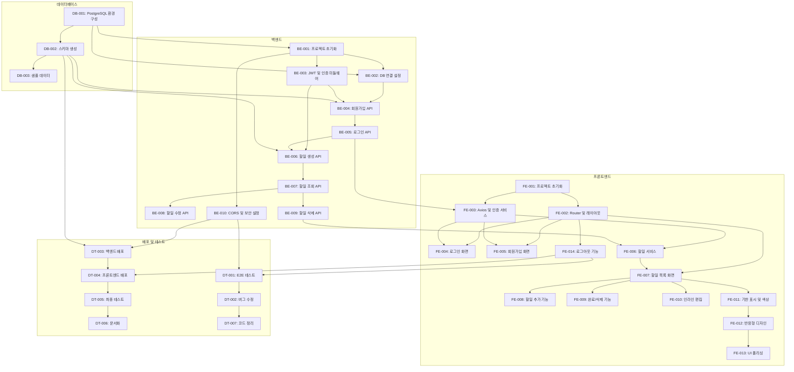

# Jan TodoList - 실행계획 (Implementation Plan)

## 문서 정보
- **버전**: 1.0
- **작성일**: 2025-11-26
- **최종 수정일**: 2025-11-26
- **작성자**: Project Manager
- **문서 상태**: 최종
- **참조 문서**: [PRD](./2-prd.md), [아키텍처 다이어그램](./5-arch-diagram.md), [ERD](./6-erd.md)

---

## 목차
1. [개요](#1-개요)
2. [데이터베이스 작업](#2-데이터베이스-작업)
3. [백엔드 작업](#3-백엔드-작업)
4. [프론트엔드 작업](#4-프론트엔드-작업)
5. [배포 및 테스트 작업](#5-배포-및-테스트-작업)
6. [Task 의존성 그래프](#6-task-의존성-그래프)
7. [타임라인 (3일 스프린트)](#7-타임라인-3일-스프린트)

---

## 1. 개요

### 1.1 실행계획 목적
본 문서는 Jan TodoList 프로젝트의 3일 스프린트 동안 수행할 모든 작업을 구체적으로 정의하고, 작업 간 의존성과 우선순위를 명확히 하여 효율적인 프로젝트 실행을 지원합니다.

### 1.2 작업 분류
- **데이터베이스 (DB)**: PostgreSQL 스키마 설정 및 마이그레이션
- **백엔드 (BE)**: Node.js + Express API 개발
- **프론트엔드 (FE)**: React + Vite UI/UX 개발
- **배포 및 테스트 (DT)**: 통합 테스트, 배포, 문서화

### 1.3 작업 표기 규칙
- **우선순위**: P0 (긴급) > P1 (높음) > P2 (중간) > P3 (낮음)
- **예상 시간**: 시간 단위 (h), 분 단위 (m)
- **의존성**: `의존: Task ID` 형태로 표시
- **완료 조건**: 하위 체크박스로 상세 나열

---

## 2. 데이터베이스 작업

### DB-001: PostgreSQL 데이터베이스 환경 구성
- **우선순위**: P0
- **예상 시간**: 30m
- **의존성**: 없음
- **담당 영역**: 데이터베이스

**작업 내용**:
- [ ] Railway 계정 생성 및 로그인
- [ ] Railway에서 PostgreSQL 인스턴스 생성
- [ ] 데이터베이스 연결 정보 확인 (DATABASE_URL)
- [ ] 로컬 환경에서 psql 또는 GUI 도구로 연결 테스트
- [ ] `.env` 파일에 DATABASE_URL 설정

**완료 조건**:
- [ ] Railway PostgreSQL 인스턴스 생성 완료
- [ ] 로컬에서 데이터베이스 연결 성공
- [ ] DATABASE_URL 환경 변수 설정 완료
- [ ] 연결 테스트 쿼리 실행 성공 (`SELECT NOW();`)

**검증 방법**:
```bash
# PostgreSQL 연결 테스트
psql $DATABASE_URL -c "SELECT NOW();"
```

---

### DB-002: 데이터베이스 스키마 생성
- **우선순위**: P0
- **예상 시간**: 30m
- **의존성**: DB-001
- **담당 영역**: 데이터베이스

**작업 내용**:
- [ ] `database/schema.sql` 스크립트 검토
- [ ] users 테이블 생성
- [ ] todos 테이블 생성
- [ ] 외래 키 제약조건 설정 (ON DELETE CASCADE)
- [ ] 인덱스 생성 (idx_todos_user_id, idx_todos_due_date)
- [ ] 테이블 코멘트 추가
- [ ] updated_at 자동 업데이트 트리거 생성

**완료 조건**:
- [ ] users 테이블 생성 완료
- [ ] todos 테이블 생성 완료
- [ ] 외래 키 제약조건 적용 완료
- [ ] 인덱스 2개 생성 완료
- [ ] 트리거 정상 동작 확인

**검증 방법**:
```sql
-- 테이블 목록 확인
SELECT table_name FROM information_schema.tables WHERE table_schema = 'public';

-- 제약조건 확인
SELECT constraint_name, constraint_type FROM information_schema.table_constraints WHERE table_name IN ('users', 'todos');

-- 인덱스 확인
SELECT indexname, tablename FROM pg_indexes WHERE schemaname = 'public';
```

---

### DB-003: 샘플 데이터 삽입 (개발 환경)
- **우선순위**: P2
- **예상 시간**: 15m
- **의존성**: DB-002
- **담당 영역**: 데이터베이스

**작업 내용**:
- [ ] 테스트 사용자 2명 생성 (bcrypt 해시된 비밀번호)
- [ ] 각 사용자별 샘플 할일 3-4개 생성
- [ ] 다양한 기한 설정 (오늘, 내일, 다음 주, 기한 없음)
- [ ] 완료/미완료 상태 혼합

**완료 조건**:
- [ ] 테스트 사용자 2명 생성 완료
- [ ] 총 6-8개 샘플 할일 생성 완료
- [ ] 샘플 데이터 조회 쿼리로 정렬 확인
- [ ] 기한별 정렬 정확도 100%

**검증 방법**:
```sql
-- 사용자별 할일 조회 (기한 순)
SELECT u.name, t.title, t.due_date, t.is_completed
FROM users u
LEFT JOIN todos t ON u.id = t.user_id
ORDER BY
  CASE WHEN t.due_date IS NULL THEN 1 ELSE 0 END,
  t.due_date ASC,
  t.created_at DESC;
```

---

## 3. 백엔드 작업

### BE-001: 백엔드 프로젝트 초기화
- **우선순위**: P0
- **예상 시간**: 30m
- **의존성**: DB-001
- **담당 영역**: 백엔드

**작업 내용**:
- [ ] 백엔드 디렉토리 생성 (`backend/`)
- [ ] `npm init -y` 실행
- [ ] 필수 패키지 설치
  - express, pg, bcrypt, jsonwebtoken, cors, dotenv
  - express-validator, helmet
- [ ] 폴더 구조 생성
  - `src/config/`, `src/middleware/`, `src/routes/`
  - `src/controllers/`, `src/models/`, `src/utils/`
- [ ] `.env.example` 파일 생성
- [ ] `.gitignore` 파일 생성
- [ ] `src/server.js` 기본 구조 작성

**완료 조건**:
- [ ] package.json 생성 완료
- [ ] 필수 패키지 8개 이상 설치 완료
- [ ] 폴더 구조 생성 완료
- [ ] .env.example 파일 작성 완료
- [ ] Express 서버 기본 구조 작성 완료

**검증 방법**:
```bash
# 서버 실행 테스트
npm start
# 또는
node src/server.js

# 응답 확인
curl http://localhost:3000/health
```

---

### BE-002: 데이터베이스 연결 설정
- **우선순위**: P0
- **예상 시간**: 20m
- **의존성**: BE-001, DB-001
- **담당 영역**: 백엔드

**작업 내용**:
- [ ] `src/config/database.js` 파일 생성
- [ ] pg Pool 객체 생성 및 설정
- [ ] 환경 변수에서 DATABASE_URL 읽기
- [ ] 연결 오류 핸들링 추가
- [ ] 연결 테스트 함수 작성

**완료 조건**:
- [ ] database.js 파일 작성 완료
- [ ] Pool 연결 설정 완료
- [ ] 연결 테스트 성공
- [ ] 에러 핸들링 구현 완료

**검증 방법**:
```javascript
// 연결 테스트
const pool = require('./src/config/database');
pool.query('SELECT NOW()', (err, res) => {
  console.log(err ? err : res.rows[0]);
  pool.end();
});
```

---

### BE-003: JWT 유틸리티 및 인증 미들웨어 구현
- **우선순위**: P0
- **예상 시간**: 45m
- **의존성**: BE-001
- **담당 영역**: 백엔드

**작업 내용**:
- [ ] `src/utils/jwt.js` 파일 생성
- [ ] JWT 토큰 생성 함수 구현 (sign)
- [ ] JWT 토큰 검증 함수 구현 (verify)
- [ ] `src/middleware/auth.js` 파일 생성
- [ ] 인증 미들웨어 구현
  - Authorization 헤더에서 토큰 추출
  - 토큰 검증
  - req.user에 사용자 정보 저장
  - 에러 핸들링

**완료 조건**:
- [ ] JWT 유틸리티 함수 2개 구현 완료
- [ ] 인증 미들웨어 구현 완료
- [ ] 토큰 만료 시간 24시간 설정 완료
- [ ] 유효하지 않은 토큰 거부 확인
- [ ] 만료된 토큰 거부 확인

**검증 방법**:
```javascript
// JWT 테스트
const jwt = require('./src/utils/jwt');
const token = jwt.sign({ userId: 1 });
const payload = jwt.verify(token);
console.log(payload); // { userId: 1, ... }
```

---

### BE-004: 회원가입 API 구현
- **우선순위**: P0
- **예상 시간**: 1h
- **의존성**: BE-002, BE-003, DB-002
- **담당 영역**: 백엔드

**작업 내용**:
- [ ] `src/routes/auth.js` 파일 생성
- [ ] `src/controllers/authController.js` 파일 생성
- [ ] `src/models/User.js` 파일 생성
- [ ] POST /api/auth/signup 라우트 구현
- [ ] 입력 검증 (express-validator)
  - 이메일 형식 검증
  - 비밀번호 최소 8자 검증
  - 이름 필수 검증
- [ ] 이메일 중복 확인
- [ ] bcrypt 비밀번호 해싱 (10 rounds)
- [ ] 사용자 DB 삽입
- [ ] JWT 토큰 생성 및 반환

**완료 조건**:
- [ ] POST /api/auth/signup 엔드포인트 동작 확인
- [ ] 유효한 데이터로 회원가입 성공
- [ ] 중복 이메일 시 400 에러 반환
- [ ] 비밀번호 8자 미만 시 400 에러 반환
- [ ] 잘못된 이메일 형식 시 400 에러 반환
- [ ] 응답에 token과 user 정보 포함
- [ ] 응답 시간 2초 이내

**검증 방법**:
```bash
# Postman 또는 curl 테스트
curl -X POST http://localhost:3000/api/auth/signup \
  -H "Content-Type: application/json" \
  -d '{
    "email": "test@example.com",
    "password": "password123",
    "name": "홍길동"
  }'

# 예상 응답
{
  "token": "eyJhbGciOiJIUzI1NiIsInR5cCI6IkpXVCJ9...",
  "user": {
    "id": 1,
    "email": "test@example.com",
    "name": "홍길동"
  }
}
```

---

### BE-005: 로그인 API 구현
- **우선순위**: P0
- **예상 시간**: 45m
- **의존성**: BE-004
- **담당 영역**: 백엔드

**작업 내용**:
- [ ] POST /api/auth/login 라우트 구현
- [ ] 입력 검증 (이메일, 비밀번호)
- [ ] 이메일로 사용자 조회
- [ ] bcrypt 비밀번호 검증
- [ ] JWT 토큰 생성 및 반환

**완료 조건**:
- [ ] POST /api/auth/login 엔드포인트 동작 확인
- [ ] 올바른 이메일/비밀번호로 로그인 성공
- [ ] 잘못된 이메일 시 401 에러 반환
- [ ] 잘못된 비밀번호 시 401 에러 반환
- [ ] 응답에 token과 user 정보 포함
- [ ] 응답 시간 2초 이내

**검증 방법**:
```bash
curl -X POST http://localhost:3000/api/auth/login \
  -H "Content-Type: application/json" \
  -d '{
    "email": "test@example.com",
    "password": "password123"
  }'
```

---

### BE-006: 할일 생성 API 구현
- **우선순위**: P0
- **예상 시간**: 45m
- **의존성**: BE-003, BE-005, DB-002
- **담당 영역**: 백엔드

**작업 내용**:
- [ ] `src/routes/todos.js` 파일 생성
- [ ] `src/controllers/todoController.js` 파일 생성
- [ ] `src/models/Todo.js` 파일 생성
- [ ] POST /api/todos 라우트 구현
- [ ] 인증 미들웨어 적용
- [ ] 입력 검증
  - 제목 1-200자 검증
  - due_date 형식 검증 (YYYY-MM-DD)
  - 과거 날짜 방지
- [ ] 할일 DB 삽입
- [ ] 생성된 할일 반환

**완료 조건**:
- [ ] POST /api/todos 엔드포인트 동작 확인
- [ ] JWT 토큰 없이 요청 시 401 에러 반환
- [ ] 제목만으로 할일 생성 성공 (기한 없이)
- [ ] 제목 + 기한으로 할일 생성 성공
- [ ] 제목 200자 초과 시 400 에러 반환
- [ ] 과거 날짜 기한 시 400 에러 반환
- [ ] 응답 시간 500ms 이내

**검증 방법**:
```bash
curl -X POST http://localhost:3000/api/todos \
  -H "Content-Type: application/json" \
  -H "Authorization: Bearer {token}" \
  -d '{
    "title": "프로젝트 제출",
    "due_date": "2025-11-27"
  }'
```

---

### BE-007: 할일 조회 API 구현
- **우선순위**: P0
- **예상 시간**: 45m
- **의존성**: BE-006
- **담당 영역**: 백엔드

**작업 내용**:
- [ ] GET /api/todos 라우트 구현
- [ ] 인증 미들웨어 적용
- [ ] 사용자별 할일 조회 쿼리 작성
- [ ] 기한 기반 정렬 로직 구현
  - 기한 있음: due_date ASC
  - 기한 없음: 맨 아래
  - 동일 기한: created_at DESC
- [ ] 할일 목록 반환

**완료 조건**:
- [ ] GET /api/todos 엔드포인트 동작 확인
- [ ] 로그인한 사용자의 할일만 조회
- [ ] 다른 사용자의 할일은 조회 불가
- [ ] 기한 순 정렬 정확도 100%
- [ ] 빈 배열 반환 시 200 상태 코드
- [ ] 응답 시간 1초 이내

**검증 방법**:
```bash
curl -X GET http://localhost:3000/api/todos \
  -H "Authorization: Bearer {token}"

# 예상 응답
[
  {
    "id": 1,
    "title": "프로젝트 제출",
    "is_completed": false,
    "due_date": "2025-11-27",
    "created_at": "2025-11-26T10:00:00Z",
    "updated_at": "2025-11-26T10:00:00Z"
  }
]
```

---

### BE-008: 할일 수정 API 구현
- **우선순위**: P1
- **예상 시간**: 1h
- **의존성**: BE-007
- **담당 영역**: 백엔드

**작업 내용**:
- [ ] PUT /api/todos/:id 라우트 구현
- [ ] 인증 미들웨어 적용
- [ ] 소유자 검증 (user_id 확인)
- [ ] 입력 검증 (제목, 기한, 완료 상태)
- [ ] 할일 업데이트 쿼리 실행
- [ ] updated_at 자동 업데이트
- [ ] 수정된 할일 반환

**완료 조건**:
- [ ] PUT /api/todos/:id 엔드포인트 동작 확인
- [ ] 제목 수정 성공
- [ ] 기한 수정 성공
- [ ] 완료 상태 토글 성공
- [ ] 다른 사용자의 할일 수정 시 403 에러 반환
- [ ] 존재하지 않는 할일 수정 시 404 에러 반환
- [ ] 응답 시간 500ms 이내

**검증 방법**:
```bash
curl -X PUT http://localhost:3000/api/todos/1 \
  -H "Content-Type: application/json" \
  -H "Authorization: Bearer {token}" \
  -d '{
    "title": "수정된 제목",
    "is_completed": true,
    "due_date": "2025-11-28"
  }'
```

---

### BE-009: 할일 삭제 API 구현
- **우선순위**: P1
- **예상 시간**: 30m
- **의존성**: BE-007
- **담당 영역**: 백엔드

**작업 내용**:
- [ ] DELETE /api/todos/:id 라우트 구현
- [ ] 인증 미들웨어 적용
- [ ] 소유자 검증 (user_id 확인)
- [ ] 할일 삭제 쿼리 실행
- [ ] 204 No Content 응답

**완료 조건**:
- [ ] DELETE /api/todos/:id 엔드포인트 동작 확인
- [ ] 할일 삭제 성공 시 204 상태 코드
- [ ] 다른 사용자의 할일 삭제 시 403 에러 반환
- [ ] 존재하지 않는 할일 삭제 시 404 에러 반환
- [ ] 응답 시간 500ms 이내

**검증 방법**:
```bash
curl -X DELETE http://localhost:3000/api/todos/1 \
  -H "Authorization: Bearer {token}"

# 예상 응답: 204 No Content (본문 없음)
```

---

### BE-010: CORS 및 보안 설정
- **우선순위**: P1
- **예상 시간**: 30m
- **의존성**: BE-001
- **담당 영역**: 백엔드

**작업 내용**:
- [ ] CORS 미들웨어 설정
  - 개발 환경: localhost:5173 허용
  - 프로덕션: Vercel 도메인 허용
- [ ] helmet.js 미들웨어 적용
- [ ] 보안 헤더 설정
- [ ] JSON body parser 설정
- [ ] 에러 핸들링 미들웨어 구현

**완료 조건**:
- [ ] CORS 설정 완료 (환경별 분리)
- [ ] helmet.js 적용 완료
- [ ] 프론트엔드에서 API 요청 성공
- [ ] 에러 핸들링 미들웨어 동작 확인
- [ ] 모든 응답에 보안 헤더 포함

**검증 방법**:
```bash
# CORS 테스트
curl -H "Origin: http://localhost:5173" \
     -H "Access-Control-Request-Method: POST" \
     -H "Access-Control-Request-Headers: Content-Type" \
     --head http://localhost:3000/api/auth/signup
```

---

## 4. 프론트엔드 작업

### FE-001: 프론트엔드 프로젝트 초기화
- **우선순위**: P0
- **예상 시간**: 30m
- **의존성**: 없음
- **담당 영역**: 프론트엔드

**작업 내용**:
- [ ] Vite + React 프로젝트 생성 (`npm create vite@latest`)
- [ ] 필수 패키지 설치
  - react-router-dom, axios, react-hook-form, date-fns
  - tailwindcss, autoprefixer, postcss
- [ ] Tailwind CSS 설정
  - `tailwind.config.js` 생성
  - `postcss.config.js` 생성
  - `src/index.css`에 Tailwind 지시어 추가
- [ ] 폴더 구조 생성
  - `src/components/`, `src/pages/`, `src/services/`
  - `src/hooks/`, `src/utils/`
- [ ] `.env.example` 파일 생성

**완료 조건**:
- [ ] Vite 프로젝트 생성 완료
- [ ] 필수 패키지 6개 이상 설치 완료
- [ ] Tailwind CSS 설정 완료
- [ ] 폴더 구조 생성 완료
- [ ] 개발 서버 실행 성공 (`npm run dev`)

**검증 방법**:
```bash
npm run dev
# http://localhost:5173 접속 확인
```

---

### FE-002: React Router 설정 및 기본 레이아웃
- **우선순위**: P0
- **예상 시간**: 45m
- **의존성**: FE-001
- **담당 영역**: 프론트엔드

**작업 내용**:
- [ ] React Router 라우트 설정
  - `/login` - 로그인 페이지
  - `/signup` - 회원가입 페이지
  - `/todos` - 할일 목록 페이지 (보호된 라우트)
  - `/*` - 404 페이지
- [ ] PrivateRoute 컴포넌트 구현 (인증 확인)
- [ ] `src/components/Layout/Header.jsx` 생성
- [ ] `src/components/Layout/Footer.jsx` 생성 (선택)
- [ ] 기본 레이아웃 구조 작성

**완료 조건**:
- [ ] 라우트 4개 설정 완료
- [ ] PrivateRoute 동작 확인 (토큰 없이 접근 시 /login 리다이렉트)
- [ ] Header 컴포넌트 렌더링 확인
- [ ] 라우트 전환 정상 동작

**검증 방법**:
```bash
# 각 경로 접속 테스트
http://localhost:5173/login
http://localhost:5173/signup
http://localhost:5173/todos
http://localhost:5173/invalid-path
```

---

### FE-003: Axios 인스턴스 및 인증 서비스 구현
- **우선순위**: P0
- **예상 시간**: 45m
- **의존성**: FE-001, BE-005
- **담당 영역**: 프론트엔드

**작업 내용**:
- [ ] `src/services/api.js` 생성
- [ ] Axios 인스턴스 생성 (baseURL 설정)
- [ ] 요청 인터셉터 구현 (JWT 토큰 자동 첨부)
- [ ] 응답 인터셉터 구현 (에러 핸들링)
- [ ] `src/services/authService.js` 생성
- [ ] signup, login 함수 구현
- [ ] `src/utils/localStorage.js` 생성 (토큰 저장/조회/삭제)

**완료 조건**:
- [ ] Axios 인스턴스 설정 완료
- [ ] 요청 시 Authorization 헤더 자동 추가
- [ ] 401 응답 시 자동 로그아웃 처리
- [ ] authService 함수 2개 구현 완료
- [ ] localStorage 유틸리티 3개 함수 구현 완료

**검증 방법**:
```javascript
import { signup, login } from './services/authService';

// 회원가입 테스트
const result = await signup('test@example.com', 'password123', '홍길동');
console.log(result); // { token, user }

// 로그인 테스트
const result2 = await login('test@example.com', 'password123');
console.log(result2); // { token, user }
```

---

### FE-004: 로그인 화면 구현
- **우선순위**: P0
- **예상 시간**: 1h
- **의존성**: FE-002, FE-003
- **담당 영역**: 프론트엔드

**작업 내용**:
- [ ] `src/pages/LoginPage.jsx` 생성
- [ ] `src/components/Auth/LoginForm.jsx` 생성
- [ ] react-hook-form 사용한 폼 구현
- [ ] 이메일, 비밀번호 입력 필드
- [ ] 클라이언트 검증 (이메일 형식, 비밀번호 필수)
- [ ] 로그인 API 호출
- [ ] 에러 메시지 표시
- [ ] 성공 시 토큰 저장 및 /todos로 리다이렉트
- [ ] "회원가입" 링크

**완료 조건**:
- [ ] 로그인 화면 렌더링 확인
- [ ] 올바른 이메일/비밀번호로 로그인 성공
- [ ] 잘못된 이메일/비밀번호 시 에러 메시지 표시
- [ ] 로그인 성공 시 /todos로 이동
- [ ] 토큰 localStorage 저장 확인
- [ ] 회원가입 링크 클릭 시 /signup 이동

**검증 방법**:
1. `/login` 접속
2. 이메일: test@example.com, 비밀번호: password123 입력
3. 로그인 버튼 클릭
4. `/todos`로 리다이렉트 확인

---

### FE-005: 회원가입 화면 구현
- **우선순위**: P0
- **예상 시간**: 1h
- **의존성**: FE-002, FE-003
- **담당 영역**: 프론트엔드

**작업 내용**:
- [ ] `src/pages/SignupPage.jsx` 생성
- [ ] `src/components/Auth/SignupForm.jsx` 생성
- [ ] react-hook-form 사용한 폼 구현
- [ ] 이메일, 비밀번호, 이름 입력 필드
- [ ] 클라이언트 검증
  - 이메일 형식
  - 비밀번호 최소 8자
  - 이름 필수
- [ ] 회원가입 API 호출
- [ ] 에러 메시지 표시
- [ ] 성공 시 토큰 저장 및 /todos로 리다이렉트
- [ ] "로그인" 링크

**완료 조건**:
- [ ] 회원가입 화면 렌더링 확인
- [ ] 유효한 데이터로 회원가입 성공
- [ ] 중복 이메일 시 에러 메시지 표시
- [ ] 비밀번호 8자 미만 시 클라이언트 에러 표시
- [ ] 회원가입 성공 시 /todos로 이동
- [ ] 로그인 링크 클릭 시 /login 이동

**검증 방법**:
1. `/signup` 접속
2. 이메일, 비밀번호, 이름 입력
3. 가입하기 버튼 클릭
4. `/todos`로 리다이렉트 확인

---

### FE-006: 할일 서비스 구현
- **우선순위**: P1
- **예상 시간**: 45m
- **의존성**: FE-003, BE-009
- **담당 영역**: 프론트엔드

**작업 내용**:
- [ ] `src/services/todoService.js` 생성
- [ ] getTodos 함수 구현 (GET /api/todos)
- [ ] createTodo 함수 구현 (POST /api/todos)
- [ ] updateTodo 함수 구현 (PUT /api/todos/:id)
- [ ] deleteTodo 함수 구현 (DELETE /api/todos/:id)
- [ ] 에러 핸들링 추가

**완료 조건**:
- [ ] todoService 함수 4개 구현 완료
- [ ] 각 함수 정상 동작 확인
- [ ] 에러 발생 시 적절한 에러 메시지 반환

**검증 방법**:
```javascript
import { getTodos, createTodo, updateTodo, deleteTodo } from './services/todoService';

// 할일 조회
const todos = await getTodos();
console.log(todos);

// 할일 생성
const newTodo = await createTodo({ title: '새로운 할일', due_date: '2025-11-27' });
console.log(newTodo);
```

---

### FE-007: 할일 목록 화면 - 기본 구조
- **우선순위**: P1
- **예상 시간**: 1h
- **의존성**: FE-002, FE-006
- **담당 영역**: 프론트엔드

**작업 내용**:
- [ ] `src/pages/TodoPage.jsx` 생성
- [ ] `src/components/Todo/TodoList.jsx` 생성
- [ ] `src/components/Todo/TodoItem.jsx` 생성
- [ ] `src/hooks/useTodos.js` 커스텀 훅 생성
- [ ] 할일 목록 조회 및 상태 관리
- [ ] 할일 목록 렌더링
- [ ] 빈 목록 안내 메시지
- [ ] 로딩 스피너

**완료 조건**:
- [ ] 할일 목록 화면 렌더링 확인
- [ ] 로그인한 사용자의 할일만 표시
- [ ] 빈 목록 시 "할일을 추가해보세요!" 메시지 표시
- [ ] 로딩 중 스피너 표시
- [ ] 할일 목록 정렬 정확도 100%

**검증 방법**:
1. 로그인 후 `/todos` 접속
2. 할일 목록 표시 확인
3. 각 할일 항목 렌더링 확인

---

### FE-008: 할일 추가 기능 구현
- **우선순위**: P1
- **예상 시간**: 1h
- **의존성**: FE-007
- **담당 영역**: 프론트엔드

**작업 내용**:
- [ ] `src/components/Todo/TodoForm.jsx` 생성
- [ ] 제목 입력 필드
- [ ] 기한 입력 필드 (date picker)
- [ ] react-hook-form 사용한 폼 구현
- [ ] 클라이언트 검증 (제목 1-200자)
- [ ] 할일 생성 API 호출
- [ ] 성공 시 목록 갱신
- [ ] Enter 키로 빠른 추가
- [ ] 에러 메시지 표시

**완료 조건**:
- [ ] 할일 추가 폼 렌더링 확인
- [ ] 제목만으로 할일 추가 성공
- [ ] 제목 + 기한으로 할일 추가 성공
- [ ] 제목 200자 초과 시 클라이언트 에러
- [ ] Enter 키로 추가 성공
- [ ] 추가 후 입력 폼 초기화
- [ ] 목록 자동 갱신 확인

**검증 방법**:
1. 제목 입력: "새로운 할일"
2. 기한 선택: 내일
3. 추가 버튼 클릭 또는 Enter
4. 목록 최상단에 추가된 할일 표시 확인

---

### FE-009: 할일 완료 토글 및 삭제 기능
- **우선순위**: P1
- **예상 시간**: 1h
- **의존성**: FE-007
- **담당 영역**: 프론트엔드

**작업 내용**:
- [ ] TodoItem에 완료 체크박스 추가
- [ ] 체크박스 클릭 시 is_completed 토글
- [ ] 할일 수정 API 호출
- [ ] 완료된 할일 시각적 구분 (회색 처리, 취소선)
- [ ] 삭제 버튼 추가
- [ ] 삭제 버튼 클릭 시 확인 대화상자
- [ ] 삭제 API 호출
- [ ] 목록 갱신

**완료 조건**:
- [ ] 체크박스 클릭으로 완료 상태 토글 성공
- [ ] 완료된 할일 시각적 구분 확인
- [ ] 삭제 버튼 클릭 시 확인 대화상자 표시
- [ ] 확인 시 할일 삭제 성공
- [ ] 취소 시 아무 변화 없음
- [ ] 목록 자동 갱신 확인

**검증 방법**:
1. 할일 체크박스 클릭
2. 완료 상태로 변경 확인 (회색 처리)
3. 삭제 버튼 클릭
4. 확인 대화상자에서 "확인" 클릭
5. 목록에서 제거 확인

---

### FE-010: 할일 인라인 편집 기능
- **우선순위**: P2
- **예상 시간**: 1h
- **의존성**: FE-007
- **담당 영역**: 프론트엔드

**작업 내용**:
- [ ] TodoItem 클릭 시 수정 모드 진입
- [ ] 제목 입력 필드로 전환
- [ ] 기한 수정 가능
- [ ] ESC 키로 취소
- [ ] Enter 키 또는 포커스 아웃으로 저장
- [ ] 할일 수정 API 호출
- [ ] 목록 갱신

**완료 조건**:
- [ ] 할일 클릭 시 수정 모드 진입
- [ ] 제목 수정 성공
- [ ] 기한 수정 성공
- [ ] ESC 키로 취소 성공
- [ ] Enter 키로 저장 성공
- [ ] 포커스 아웃으로 저장 성공
- [ ] 목록 자동 재정렬 확인

**검증 방법**:
1. 할일 클릭
2. 제목 수정: "수정된 제목"
3. Enter 키 또는 다른 곳 클릭
4. 수정 반영 확인

---

### FE-011: 기한 표시 및 색상 구분
- **우선순위**: P1
- **예상 시간**: 45m
- **의존성**: FE-007
- **담당 영역**: 프론트엔드

**작업 내용**:
- [ ] `src/utils/dateFormat.js` 생성
- [ ] 기한 포맷팅 함수 구현
  - 오늘: "오늘" (빨간색)
  - 내일: "내일" (주황색)
  - 이번 주: "11월 28일 (목)" (노란색)
  - 그 이후: "12월 1일" (회색)
  - 기한 없음: 표시 안 함
- [ ] date-fns 사용한 날짜 계산
- [ ] TodoItem에 기한 표시 추가
- [ ] 기한별 색상 클래스 적용

**완료 조건**:
- [ ] 기한 포맷팅 함수 정상 동작
- [ ] "오늘" 할일 빨간색 표시
- [ ] "내일" 할일 주황색 표시
- [ ] 이후 날짜 적절한 색상 표시
- [ ] 기한 없는 할일 표시 안 함
- [ ] 모바일에서도 가독성 유지

**검증 방법**:
1. 오늘 기한 할일 생성
2. "오늘" 텍스트 빨간색 표시 확인
3. 내일 기한 할일 생성
4. "내일" 텍스트 주황색 표시 확인

---

### FE-012: 반응형 디자인 적용
- **우선순위**: P1
- **예상 시간**: 1.5h
- **의존성**: FE-011
- **담당 영역**: 프론트엔드

**작업 내용**:
- [ ] Tailwind 브레이크포인트 사용
  - 모바일 (< 768px)
  - 태블릿 (768px ~ 1024px)
  - 데스크톱 (> 1024px)
- [ ] 모바일 레이아웃
  - 세로 스택 레이아웃
  - 하단 고정 추가 버튼
  - 터치 영역 최소 44x44px
- [ ] 데스크톱 레이아웃
  - 중앙 정렬 (최대 너비 1200px)
  - 좌우 여백
- [ ] 크로스 브라우징 테스트

**완료 조건**:
- [ ] 모바일 (< 768px) 레이아웃 정상 표시
- [ ] 태블릿 (768px ~ 1024px) 레이아웃 정상 표시
- [ ] 데스크톱 (> 1024px) 레이아웃 정상 표시
- [ ] 모바일 터치 영역 44x44px 이상
- [ ] Chrome, Firefox, Safari 동작 확인

**검증 방법**:
1. Chrome DevTools 모바일 시뮬레이션
2. 각 브레이크포인트에서 레이아웃 확인
3. 실제 모바일 기기 테스트

---

### FE-013: UI 폴리싱 및 애니메이션
- **우선순위**: P2
- **예상 시간**: 1.5h
- **의존성**: FE-012
- **담당 영역**: 프론트엔드

**작업 내용**:
- [ ] 로딩 스피너 디자인
- [ ] 토스트 알림 컴포넌트
- [ ] 할일 추가/삭제 애니메이션
- [ ] 완료 체크 애니메이션
- [ ] 호버 효과
- [ ] 포커스 스타일
- [ ] 부드러운 전환 효과

**완료 조건**:
- [ ] 로딩 스피너 정상 동작
- [ ] 토스트 알림 표시 확인
- [ ] 할일 추가 시 슬라이드인 애니메이션
- [ ] 할일 삭제 시 페이드아웃 애니메이션
- [ ] 완료 체크 시 체크마크 애니메이션
- [ ] 모든 전환 0.2s ease-in-out

**검증 방법**:
1. 할일 추가 시 애니메이션 확인
2. 할일 삭제 시 애니메이션 확인
3. 체크박스 클릭 시 애니메이션 확인

---

### FE-014: 로그아웃 및 사용자 정보 표시
- **우선순위**: P2
- **예상 시간**: 30m
- **의존성**: FE-002
- **담당 영역**: 프론트엔드

**작업 내용**:
- [ ] Header에 사용자 이름 표시
- [ ] 로그아웃 버튼 추가
- [ ] 로그아웃 클릭 시 localStorage 토큰 삭제
- [ ] /login으로 리다이렉트
- [ ] useAuth 커스텀 훅 생성

**완료 조건**:
- [ ] Header에 사용자 이름 표시
- [ ] 로그아웃 버튼 클릭 시 즉시 로그아웃
- [ ] /login으로 자동 이동
- [ ] 토큰 삭제 확인
- [ ] 뒤로 가기로 /todos 접근 불가

**검증 방법**:
1. 로그인 후 Header 확인
2. 사용자 이름 표시 확인
3. 로그아웃 버튼 클릭
4. /login으로 리다이렉트 확인
5. 뒤로 가기 시 다시 /login으로 이동 확인

---

## 5. 배포 및 테스트 작업

### DT-001: E2E 테스트 시나리오 실행
- **우선순위**: P0
- **예상 시간**: 1h
- **의존성**: FE-014, BE-010
- **담당 영역**: QA / 통합

**작업 내용**:
- [ ] 시나리오 1: 회원가입 → 로그인 → 할일 3개 추가
- [ ] 시나리오 2: 할일 수정 → 완료 → 삭제
- [ ] 시나리오 3: 기한 설정 → 정렬 확인
- [ ] 시나리오 4: 로그아웃 → 재로그인 (토큰 유지)
- [ ] 시나리오 5: 모바일 화면 테스트
- [ ] 버그 목록 작성

**완료 조건**:
- [ ] 시나리오 1 통과
- [ ] 시나리오 2 통과
- [ ] 시나리오 3 통과
- [ ] 시나리오 4 통과
- [ ] 시나리오 5 통과
- [ ] 발견된 버그 문서화
- [ ] Critical/High 버그 0개

**검증 방법**:
- 각 시나리오를 수동으로 실행하고 결과 기록
- 발견된 버그는 우선순위별로 분류

---

### DT-002: 버그 수정
- **우선순위**: P0
- **예상 시간**: 1.5h
- **의존성**: DT-001
- **담당 영역**: 개발

**작업 내용**:
- [ ] DT-001에서 발견된 버그 목록 확인
- [ ] Critical 버그 우선 수정
- [ ] High 버그 수정
- [ ] Medium 버그 수정 (시간 허용 시)
- [ ] 재테스트

**완료 조건**:
- [ ] Critical 버그 100% 수정
- [ ] High 버그 100% 수정
- [ ] Medium 버그 80% 이상 수정
- [ ] 모든 수정 사항 재테스트 통과

**검증 방법**:
- 수정된 버그에 대해 DT-001 시나리오 재실행
- 회귀 테스트 (기존 기능 정상 동작 확인)

---

### DT-003: 백엔드 배포 (Railway)
- **우선순위**: P0
- **예상 시간**: 1h
- **의존성**: BE-010, DB-002
- **담당 영역**: DevOps

**작업 내용**:
- [ ] Railway 계정 생성 및 프로젝트 생성
- [ ] GitHub 저장소 연결
- [ ] Railway PostgreSQL 프로덕션 DB 생성
- [ ] 환경 변수 설정
  - DATABASE_URL (자동)
  - JWT_SECRET (수동)
  - CORS_ORIGIN (Vercel 도메인)
  - NODE_ENV=production
- [ ] 배포 실행
- [ ] API 엔드포인트 테스트

**완료 조건**:
- [ ] Railway 백엔드 배포 성공
- [ ] 프로덕션 DB 생성 완료
- [ ] 환경 변수 4개 이상 설정 완료
- [ ] API Health Check 성공
- [ ] 회원가입/로그인 API 테스트 성공

**검증 방법**:
```bash
# API Health Check
curl https://jan-todolist-api.railway.app/health

# 회원가입 테스트
curl -X POST https://jan-todolist-api.railway.app/api/auth/signup \
  -H "Content-Type: application/json" \
  -d '{"email":"deploy-test@example.com","password":"password123","name":"테스트"}'
```

---

### DT-004: 프론트엔드 배포 (Vercel)
- **우선순위**: P0
- **예상 시간**: 1h
- **의존성**: FE-014, DT-003
- **담당 영역**: DevOps

**작업 내용**:
- [ ] Vercel 계정 생성 및 프로젝트 생성
- [ ] GitHub 저장소 연결
- [ ] 빌드 설정
  - Framework: Vite
  - Build Command: npm run build
  - Output Directory: dist
- [ ] 환경 변수 설정
  - VITE_API_URL (Railway API URL)
- [ ] 배포 실행
- [ ] 배포 URL 확인

**완료 조건**:
- [ ] Vercel 프론트엔드 배포 성공
- [ ] 환경 변수 설정 완료
- [ ] 빌드 성공
- [ ] 배포 URL 접속 가능
- [ ] 프론트엔드-백엔드 통신 정상

**검증 방법**:
1. Vercel 배포 URL 접속
2. 회원가입 진행
3. 로그인 진행
4. 할일 CRUD 동작 확인

---

### DT-005: 최종 테스트 및 성능 검증
- **우선순위**: P0
- **예상 시간**: 1h
- **의존성**: DT-004
- **담당 영역**: QA

**작업 내용**:
- [ ] 프로덕션 환경에서 전체 플로우 테스트
- [ ] 모바일/데스크톱 크로스 브라우징
- [ ] Lighthouse 성능 테스트
- [ ] 보안 점검
  - HTTPS 적용 확인
  - CORS 설정 확인
  - JWT 토큰 만료 확인
- [ ] 응답 시간 측정

**완료 조건**:
- [ ] 전체 플로우 테스트 통과
- [ ] Chrome, Firefox, Safari 동작 확인
- [ ] 모바일 (iOS, Android) 동작 확인
- [ ] Lighthouse 성능 점수 80점 이상
- [ ] Lighthouse 접근성 점수 90점 이상
- [ ] HTTPS 적용 확인
- [ ] 평균 응답 시간 1초 이내

**검증 방법**:
```bash
# Lighthouse 테스트
lighthouse https://jan-todolist.vercel.app --view

# 응답 시간 측정
curl -w "@curl-format.txt" -o /dev/null -s https://jan-todolist-api.railway.app/api/todos
```

---

### DT-006: README 및 문서화
- **우선순위**: P1
- **예상 시간**: 1.5h
- **의존성**: DT-005
- **담당 영역**: 문서화

**작업 내용**:
- [ ] README.md 작성
  - 프로젝트 소개
  - 주요 기능
  - 기술 스택
  - 로컬 실행 방법
  - 배포 URL
  - 스크린샷 (5개 이상)
  - API 문서 링크
- [ ] API 문서 간단히 작성 (Postman Collection 또는 Markdown)
- [ ] 환경 변수 템플릿 (.env.example) 확인
- [ ] 라이선스 추가 (MIT)

**완료 조건**:
- [ ] README.md 작성 완료
- [ ] 프로젝트 소개 섹션
- [ ] 기능 목록 섹션
- [ ] 기술 스택 섹션
- [ ] 로컬 실행 방법 섹션
- [ ] 배포 URL 섹션
- [ ] 스크린샷 5개 이상 추가
- [ ] API 문서 링크 또는 간단한 API 명세

**검증 방법**:
1. GitHub 저장소에서 README.md 확인
2. 로컬 실행 방법대로 실행 테스트
3. 스크린샷 정상 표시 확인

---

### DT-007: 코드 정리 및 최적화
- **우선순위**: P2
- **예상 시간**: 30m
- **의존성**: DT-002
- **담당 영역**: 개발

**작업 내용**:
- [ ] 콘솔 로그 제거
- [ ] 미사용 코드 제거
- [ ] 미사용 패키지 제거
- [ ] ESLint 경고 수정
- [ ] 코드 포맷팅 (Prettier)

**완료 조건**:
- [ ] console.log 모두 제거
- [ ] 미사용 import 모두 제거
- [ ] ESLint 경고 0개
- [ ] 코드 포맷팅 일관성 100%

**검증 방법**:
```bash
# ESLint 검사
npm run lint

# Prettier 검사
npm run format:check
```

---

## 6. Task 의존성 그래프

### 6.1 시각적 의존성 그래프



### 6.2 병렬 작업 가능한 Task 그룹

**그룹 1 (시작 가능, 의존성 없음)**:
- DB-001: PostgreSQL 환경 구성
- BE-001: 백엔드 프로젝트 초기화
- FE-001: 프론트엔드 프로젝트 초기화

**그룹 2 (DB-001 완료 후)**:
- DB-002: 스키마 생성
- BE-002: DB 연결 설정
- BE-003: JWT 및 인증 미들웨어 (BE-001 후)
- FE-002: Router 및 레이아웃 (FE-001 후)

**그룹 3 (BE-002, BE-003, DB-002 완료 후)**:
- BE-004: 회원가입 API
- FE-003: Axios 및 인증 서비스 (FE-001 후)

**그룹 4 (BE-004, BE-005 완료 후)**:
- BE-006, BE-007, BE-008, BE-009: 할일 CRUD API (순차 또는 병렬)
- FE-004, FE-005: 로그인/회원가입 화면 (FE-002, FE-003 후, 병렬 가능)

**그룹 5 (FE-006, FE-007 완료 후)**:
- FE-008, FE-009, FE-010, FE-011: 할일 기능들 (병렬 가능)

---

## 7. 타임라인 (3일 스프린트)

### Day 1: 2025-11-26 (화) - 인증 + 할일 CRUD API

#### 오전 (9:00 - 13:00, 4시간)

**09:00 - 09:30 (30m)**: 프로젝트 초기화
- [ ] DB-001: PostgreSQL 환경 구성 (30m)
- [ ] BE-001: 백엔드 프로젝트 초기화 (30m, 병렬)
- [ ] FE-001: 프론트엔드 프로젝트 초기화 (30m, 병렬)

**09:30 - 10:00 (30m)**: 데이터베이스 및 연결 설정
- [ ] DB-002: 스키마 생성 (30m)
- [ ] BE-002: DB 연결 설정 (20m, 병렬)

**10:00 - 10:45 (45m)**: 인증 기반 구축
- [ ] BE-003: JWT 및 인증 미들웨어 (45m)

**10:45 - 11:45 (1h)**: 회원가입 API
- [ ] BE-004: 회원가입 API (1h)

**11:45 - 12:30 (45m)**: 로그인 API
- [ ] BE-005: 로그인 API (45m)

**12:30 - 13:00 (30m)**: API 테스트 및 점검
- Postman으로 회원가입/로그인 테스트
- JWT 토큰 발급 확인

#### 오후 (14:00 - 18:00, 4시간)

**14:00 - 14:45 (45m)**: 할일 생성 API
- [ ] BE-006: 할일 생성 API (45m)

**14:45 - 15:30 (45m)**: 할일 조회 API
- [ ] BE-007: 할일 조회 API (45m)

**15:30 - 16:30 (1h)**: 할일 수정 API
- [ ] BE-008: 할일 수정 API (1h)

**16:30 - 17:00 (30m)**: 할일 삭제 API
- [ ] BE-009: 할일 삭제 API (30m)

**17:00 - 17:30 (30m)**: CORS 및 보안 설정
- [ ] BE-010: CORS 및 보안 설정 (30m)

**17:30 - 18:00 (30m)**: Day 1 통합 테스트
- Postman으로 모든 API 엔드포인트 테스트
- 버그 발견 시 기록

#### Day 1 완료 기준
- [x] 회원가입/로그인 API 정상 동작
- [x] 할일 CRUD API 4개 모두 정상 동작
- [x] JWT 인증 미들웨어 적용
- [x] CORS 설정 완료
- [x] Postman 테스트 100% 통과

---

### Day 2: 2025-11-27 (수) - 프론트엔드 개발

#### 오전 (9:00 - 13:00, 4시간)

**09:00 - 09:45 (45m)**: React 기본 설정
- [ ] FE-002: Router 및 레이아웃 (45m)

**09:45 - 10:30 (45m)**: API 통신 설정
- [ ] FE-003: Axios 및 인증 서비스 (45m)

**10:30 - 11:30 (1h)**: 로그인 화면
- [ ] FE-004: 로그인 화면 (1h)

**11:30 - 12:30 (1h)**: 회원가입 화면
- [ ] FE-005: 회원가입 화면 (1h)

**12:30 - 13:00 (30m)**: 인증 기능 테스트
- 회원가입 → 로그인 플로우 테스트
- 토큰 저장 및 자동 로그인 확인

#### 오후 (14:00 - 18:00, 4시간)

**14:00 - 14:45 (45m)**: 할일 서비스
- [ ] FE-006: 할일 서비스 (45m)

**14:45 - 15:45 (1h)**: 할일 목록 화면
- [ ] FE-007: 할일 목록 화면 (1h)

**15:45 - 16:45 (1h)**: 할일 추가 기능
- [ ] FE-008: 할일 추가 기능 (1h)

**16:45 - 17:45 (1h)**: 완료/삭제 기능
- [ ] FE-009: 완료/삭제 기능 (1h)

**17:45 - 18:00 (15m)**: Day 2 통합 테스트
- 전체 플로우 테스트 (회원가입 → 로그인 → 할일 CRUD)

#### Day 2 완료 기준
- [x] 로그인/회원가입 화면 완성
- [x] 할일 목록 화면 완성
- [x] 할일 CRUD 기능 모두 동작
- [x] 프론트엔드-백엔드 통신 정상

---

### Day 3: 2025-11-28 (목) - UI/UX 개선 + 배포

#### 오전 (9:00 - 12:00, 3시간)

**09:00 - 10:00 (1h)**: 추가 기능 구현
- [ ] FE-010: 인라인 편집 (1h, 선택)
- 또는
- [ ] FE-011: 기한 표시 및 색상 (45m)

**10:00 - 11:30 (1.5h)**: 반응형 디자인
- [ ] FE-012: 반응형 디자인 (1.5h)

**11:30 - 12:00 (30m)**: 로그아웃 기능
- [ ] FE-014: 로그아웃 기능 (30m)

#### 오후 (13:00 - 18:00, 5시간)

**13:00 - 14:00 (1h)**: E2E 테스트
- [ ] DT-001: E2E 테스트 시나리오 실행 (1h)

**14:00 - 15:30 (1.5h)**: 버그 수정
- [ ] DT-002: 버그 수정 (1.5h)

**15:30 - 16:30 (1h)**: 백엔드 배포
- [ ] DT-003: 백엔드 배포 (Railway) (1h)

**16:30 - 17:30 (1h)**: 프론트엔드 배포
- [ ] DT-004: 프론트엔드 배포 (Vercel) (1h)

**17:30 - 18:30 (1h)**: 최종 테스트
- [ ] DT-005: 최종 테스트 및 성능 검증 (1h)

**18:30 - 20:00 (1.5h)**: 문서화 (연장)
- [ ] DT-006: README 및 문서화 (1.5h)

#### Day 3 완료 기준
- [x] 반응형 디자인 적용
- [x] Critical/High 버그 0개
- [x] 백엔드 배포 완료 (Railway)
- [x] 프론트엔드 배포 완료 (Vercel)
- [x] Lighthouse 성능 점수 80점 이상
- [x] README 문서화 완료

---

## 8. 리스크 관리

### 8.1 주요 리스크 및 대응 방안

| 리스크 | 확률 | 영향 | 대응 방안 |
|--------|------|------|----------|
| Day 1 백엔드 API 개발 지연 | 중 | 높음 | UI 폴리싱 축소, 인라인 편집 제외 |
| Day 2 프론트엔드 개발 지연 | 중 | 높음 | 애니메이션 제외, 기본 기능만 구현 |
| Day 3 배포 실패 | 낮 | 높음 | Day 2 저녁에 배포 환경 사전 준비 |
| Railway/Vercel 연결 문제 | 낮 | 중 | 로컬 환경 테스트로 기능 검증 |
| 크로스 브라우저 이슈 | 중 | 중 | Chrome 우선, Safari는 Phase 2 |

### 8.2 일일 체크포인트

**매일 18:00**: 진행 상황 점검
- 완료된 Task 확인
- 지연된 Task 파악
- 내일 우선순위 조정

**매일 18:30**: 코드 커밋 및 푸시
- Git commit with 의미 있는 메시지
- GitHub에 푸시

---

## 부록

### A. Task 요약표

| Task ID | Task 이름 | 우선순위 | 예상 시간 | 담당 영역 |
|---------|----------|---------|-----------|----------|
| DB-001 | PostgreSQL 환경 구성 | P0 | 30m | 데이터베이스 |
| DB-002 | 스키마 생성 | P0 | 30m | 데이터베이스 |
| DB-003 | 샘플 데이터 삽입 | P2 | 15m | 데이터베이스 |
| BE-001 | 백엔드 프로젝트 초기화 | P0 | 30m | 백엔드 |
| BE-002 | DB 연결 설정 | P0 | 20m | 백엔드 |
| BE-003 | JWT 및 인증 미들웨어 | P0 | 45m | 백엔드 |
| BE-004 | 회원가입 API | P0 | 1h | 백엔드 |
| BE-005 | 로그인 API | P0 | 45m | 백엔드 |
| BE-006 | 할일 생성 API | P0 | 45m | 백엔드 |
| BE-007 | 할일 조회 API | P0 | 45m | 백엔드 |
| BE-008 | 할일 수정 API | P1 | 1h | 백엔드 |
| BE-009 | 할일 삭제 API | P1 | 30m | 백엔드 |
| BE-010 | CORS 및 보안 설정 | P1 | 30m | 백엔드 |
| FE-001 | 프론트엔드 프로젝트 초기화 | P0 | 30m | 프론트엔드 |
| FE-002 | Router 및 레이아웃 | P0 | 45m | 프론트엔드 |
| FE-003 | Axios 및 인증 서비스 | P0 | 45m | 프론트엔드 |
| FE-004 | 로그인 화면 | P0 | 1h | 프론트엔드 |
| FE-005 | 회원가입 화면 | P0 | 1h | 프론트엔드 |
| FE-006 | 할일 서비스 | P1 | 45m | 프론트엔드 |
| FE-007 | 할일 목록 화면 | P1 | 1h | 프론트엔드 |
| FE-008 | 할일 추가 기능 | P1 | 1h | 프론트엔드 |
| FE-009 | 완료/삭제 기능 | P1 | 1h | 프론트엔드 |
| FE-010 | 인라인 편집 | P2 | 1h | 프론트엔드 |
| FE-011 | 기한 표시 및 색상 | P1 | 45m | 프론트엔드 |
| FE-012 | 반응형 디자인 | P1 | 1.5h | 프론트엔드 |
| FE-013 | UI 폴리싱 | P2 | 1.5h | 프론트엔드 |
| FE-014 | 로그아웃 기능 | P2 | 30m | 프론트엔드 |
| DT-001 | E2E 테스트 | P0 | 1h | QA |
| DT-002 | 버그 수정 | P0 | 1.5h | 개발 |
| DT-003 | 백엔드 배포 | P0 | 1h | DevOps |
| DT-004 | 프론트엔드 배포 | P0 | 1h | DevOps |
| DT-005 | 최종 테스트 | P0 | 1h | QA |
| DT-006 | 문서화 | P1 | 1.5h | 문서화 |
| DT-007 | 코드 정리 | P2 | 30m | 개발 |

**총 예상 시간**: 약 27시간 (3일 × 9시간 = 27시간)

---

### B. 참고 문서

- [PRD (Product Requirements Document)](./2-prd.md)
- [아키텍처 다이어그램](./5-arch-diagram.md)
- [ERD (Entity Relationship Diagram)](./6-erd.md)
- [Database Schema](../database/schema.sql)

---

**문서 작성 완료일**: 2025-11-26
**다음 단계**: 이 실행계획에 따라 Day 1부터 개발 시작
